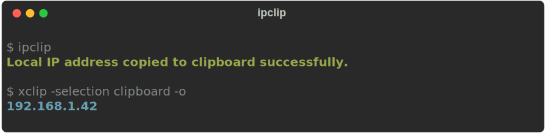

<div align="center">
  
  <h1>ipclip</h1>
  <p><strong>Copy your local IP address to the clipboard. That's it.</strong></p>
  <p>
    
    
    
  </p>
</div>

<br />

## Why ipclip?

Because typing `ip route get 1 | grep -oP 'src \K\S+'` and then manually selecting and copying the output is one too many steps when you do it ten times a day. `ipclip` does it in one command.

---

## Demo

<div align="center">
  
</div>

## Install

```bash
# From source
git clone https://github.com/TheDarkArtist/ipclip.git
cd ipclip
cargo build --release

# Copy to PATH
sudo cp target/release/ipclip /usr/local/bin/
```

### Requirements

- Linux (uses `ip` command) or Windows (`clip.exe`)
- `xclip` on Linux (`sudo pacman -S xclip` / `sudo apt install xclip`)

## Usage

```bash
ipclip
# => "Local IP address copied to clipboard successfully."
# Your local IP is now in your clipboard. Ctrl+V away.
```

## How It Works

Runs `ip route get 1` to find the default route source IP, pipes it through `grep` to extract the address, and sends it to `xclip` to land in your clipboard. One shell command, wrapped in Rust for a clean binary.

## Tech Stack

<p>
  
</p>

## Contributing

```bash
git clone https://github.com/TheDarkArtist/ipclip.git
cd ipclip
cargo build
```

<details>
<summary><strong>Contributing Guidelines</strong></summary>

1. Fork the repo
2. Create a branch (`git checkout -b feature/my-thing`)
3. Make your changes
4. Open a PR

</details>

<details>
<summary><strong>Contributor Graph</strong></summary>
<p>
  <a href="https://github.com/TheDarkArtist/ipclip/graphs/contributors">
    
  </a>
</p>
</details>

## License

[MIT](LICENSE)

<br />

<div align="center">
  <sub>Built by <a href="https://thedarkartist.in">TheDarkArtist</a></sub>
</div>
